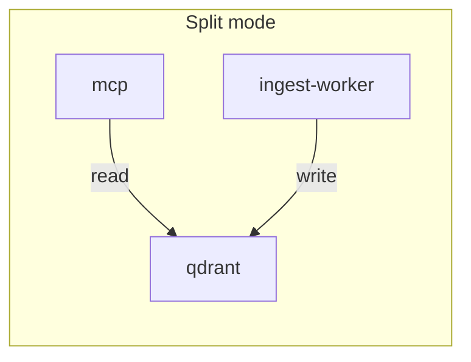
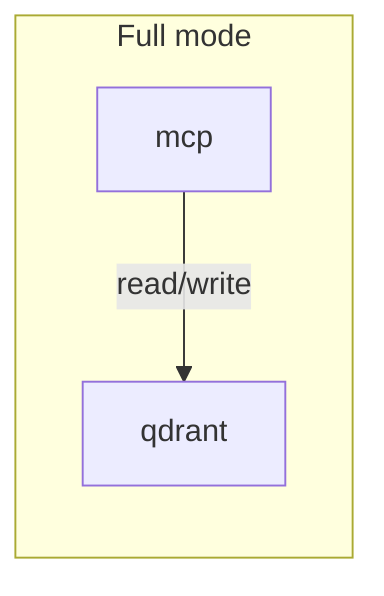

# Архитектура 1C Help MCP

Читайте этот файл, если нужен технический reference по сервисам, deployment-режимам и operational поведению.

Краткое объяснение без деталей: [../explanation/how-it-works.md](../explanation/how-it-works.md).

## Сервисы и ответственность

| Сервис | Роль | Ресурсы | Порт |
|--------|------|---------|------|
| **qdrant** | Векторная БД (structured help, onec_help_memory, metadata) | Хранилище | 6333 |
| **mcp** | MCP API — structured API search/answers, memory, metadata | I/O, embedding для memory | 8050 |
| **ingest-worker** | Batch ETL: ingest, cron, load-snippets, watchdog | CPU, RAM, embedding API | — |
| **bsl-bridge** | BSL LS MCP — диагностика, рефакторинг (отдельно: `make bsl-start`) | Java/BSL LS | — |

## Коллекции Qdrant

- **onec_help_api_members** — основной runtime-индекс structured API
- **onec_help_api_objects** — объектный слой structured help
- **onec_help_examples** — официальные примеры
- **onec_help_api_links** — связи между API-сущностями
- **onec_help_memory** — snippets, standards, session events (пишут memory, load-snippets, load-standards)

Подробнее об embedding, batch-пайплайне, retry и переменных — см. [embedding.md](embedding.md).

## Режимы развёртывания

### Split (по умолчанию)

`mcp` только MCP API (`MCP_MODE=api`), `ingest-worker` — все write-операции. Рекомендуется для большинства сценариев.



Запуск:
```bash
docker compose up -d
# или: make up
```

Индексация: `make ingest-up` (поднять ingest-worker), затем `make ingest` или через watchdog.

### Full (один контейнер)

Один контейнер `mcp` выполняет MCP API, ingest при старте, cron, load-snippets и watchdog. `MCP_MODE=full`. Подходит для локальной разработки или малой нагрузки.



Запуск:
```bash
docker compose -f docker-compose.full.yml up -d
# или: make up-full
```

Индексация: `make ingest-full` или `docker compose -f docker-compose.full.yml exec mcp python -m onec_help ingest`.

## Будущие улучшения (при росте)

- **Очередь задач:** замена cron на Celery/RQ + Redis или API webhook для ingest — масштабирование и retry при сбоях.

## Когда использовать full (один контейнер)

- Локальная разработка
- Один пользователь, малая нагрузка
- Минимизация ресурсов (меньше контейнеров)

## Старт MCP и диагностика

В Docker контейнер MCP запускается через **быстрый entry point** `python -m onec_help.interfaces.mcp_server` (без загрузки всего CLI), чтобы порт 8050 открывался быстрее. Если MCP «лежит» и подключение невозможно:

1. **Логи:** `docker compose logs mcp` — падения, исключения при старте, недоступность Qdrant/embedding API.
2. **Healthcheck:** у сервиса `mcp` задан `start_period: 45s` — контейнеру даётся до 45 с на первый прогрев; затем проверка каждые 15 с (retries 5). При нехватке ресурсов или блокировке при старте увеличьте `start_period` в `docker-compose.base.yml`.
3. **Зависимость от Qdrant:** MCP стартует только после `qdrant: condition: service_healthy`. Если Qdrant долго поднимается, MCP ждёт. Ingest при этом может уже работать в отдельном контейнере (ingest-worker).

Локально тот же быстрый старт: `python -m onec_help.interfaces.mcp_server /data --transport streamable-http --host 0.0.0.0 --port 8050`.

## Переменная MCP_MODE

- **`api`** (split, по умолчанию) — только основной процесс (MCP), без фоновых jobs
- **`full`** — entrypoint запускает ingest, cron, watchdog, load-snippets в фоне

## Пересборка и обновление при изменениях

### Split (по умолчанию)

Сборка отдельно от запуска (принцип единственной ответственности):

```bash
# Сборка образов
make build
# или один сервис: make build SERVICE=mcp

# Запуск (после сборки)
make up
```

### Full

```bash
make build-full
make up-full
```

### Типовой workflow при изменениях

| Что меняли | Команда (split) | Команда (full) |
|------------|-----------------|----------------|
| Код Python (onec_help) | `make build && make up` | `make build-full && make up-full` |
| Только MCP API | `make build SERVICE=mcp && make up` | `make build-full && make up-full` |
| Только ingest/cron | `make build && make ingest-up` | `make build-full && make up-full` |
| Dockerfile, requirements | `make build && make up` | `make build-full && make up-full` |
| Только env/volumes в compose | `make up` | `make up-full` |

Изменение env или volumes не требует пересборки — Compose пересоздаёт только затронутые контейнеры.
